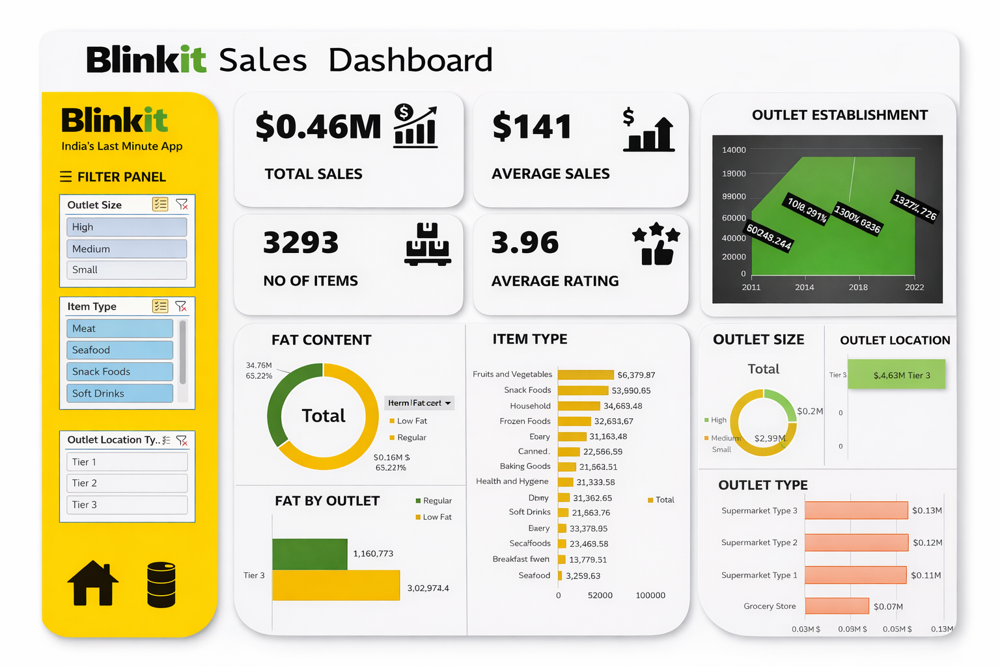

# 🛒 Blinkit Data Analysis Project

An end-to-end data analysis project on Blinkit grocery sales using **Excel, MySQL, and Python** to extract insights, clean data, and build an interactive dashboard.

---

## 📸 Dashboard Preview

---

## 📁 Project Files

- **Blinkit_Analyser.xlsm**  
  → Interactive Excel dashboard (Data + Pivot Tables + Dashboard)

- **BlinkIT Grocery Data.xlsx**  
  → Raw dataset used for analysis

- **Python_Visualizer.ipynb**  
  → Data analysis and visualization using Python (Pandas, Matplotlib)

- **Queries_mysql.pdf**  
  → SQL queries for data cleaning, transformation, and analysis

---

## ⚙️ Tools & Technologies Used

- **Microsoft Excel**
  - Pivot Tables
  - Slicers
  - KPI Cards
  - Interactive Dashboard

- **MySQL**
  - Data Cleaning
  - Aggregations
  - Pivoting
  - KPI Queries

- **Python**
  - Pandas (Data Manipulation)
  - Matplotlib (Visualization)

---

## 🧹 Data Cleaning (MySQL)

- Standardized inconsistent values in `Item_Fat_Content`
  - `LF`, `low fat` → `Low Fat`
  - `reg` → `Regular`
- Renamed columns to remove spaces and improve query efficiency
- Ensured uniform data for accurate aggregation and reporting

---

## 📊 Key KPIs

- **Total Sales** → Calculated in Millions
- **Average Sales**
- **Number of Items**
- **Average Rating**

---

## 📈 Analysis Performed

### 1. Sales by Fat Content
- Compared **Low Fat vs Regular** product performance

### 2. Sales by Item Type
- Identified top-performing product categories

### 3. Sales by Outlet Establishment Year
- Analyzed growth trend over time

### 4. Sales Distribution by Outlet Size
- Calculated percentage contribution of:
  - Small
  - Medium
  - High

### 5. Sales by Outlet Location (Tier 1, 2, 3)
- Compared performance across city tiers

### 6. Sales by Outlet Type
- Included:
  - Total Sales
  - Average Sales
  - Number of Items
  - Average Rating
  - Item Visibility

### 7. Fat Content by Outlet (Pivot Analysis)
- Used SQL pivoting to compare Low Fat vs Regular across locations

---

## 📊 Excel Dashboard Features

- Dynamic KPI cards
- Interactive slicers:
  - Outlet Size
  - Item Type
  - Outlet Location
- Visualizations:
  - Donut Chart (Fat Content)
  - Bar Charts (Item Type, Outlet Type)
  - Funnel Chart (Tier-wise Sales)
  - Line Chart (Establishment Trend)

---

## 🔍 Key Insights

- 🥇 **Tier 3 outlets generate the highest sales**
- 🥗 **Low Fat items contribute more revenue than Regular**
- 🏪 **Supermarket Type 3 performs the best**
- 📦 **Outlet size significantly affects sales distribution**
- 📊 **Item visibility plays a role in sales performance**

---

## 🚀 How to Use

1. Open **Blinkit_Analyser.xlsm**
2. Go to **Dashboard sheet**
3. Use slicers to filter:
   - Outlet Size
   - Item Type
   - Location
4. Explore insights interactively

---

## 💡 Project Objective

To demonstrate:
- Data cleaning using SQL
- Data analysis across multiple tools
- Dashboard creation in Excel
- Business insight generation from raw data

---
